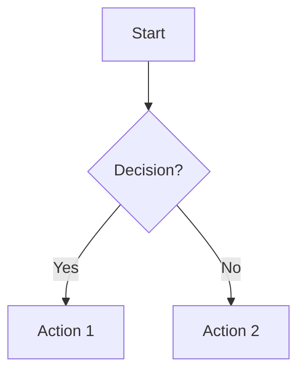
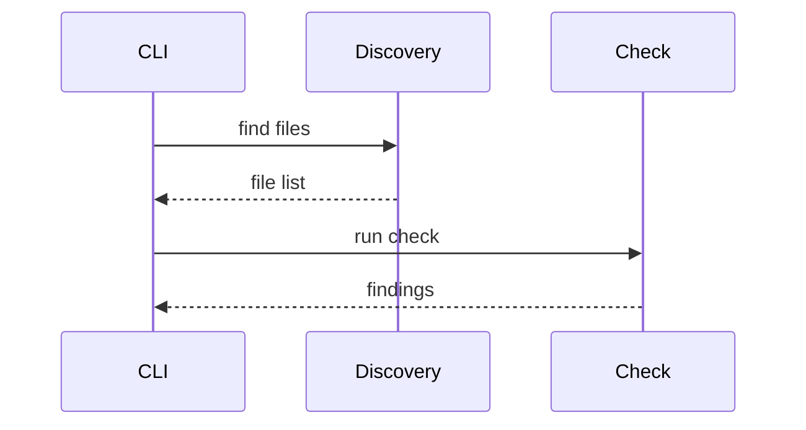
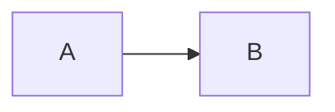

# Mermaid Diagram Guidelines

Use Mermaid diagrams to make documentation clearer and easier to understand.

## When to Use Diagrams

**Use Mermaid diagrams when:**
- Visual representation makes concepts clearer than prose alone
- Showing relationships, flows, or structures
- Documenting processes, architectures, or interactions

**Avoid diagrams when:**
- Simple text or a list is equally clear
- The diagram would be overly complex (>20 nodes)

## Diagram Types

### Flowcharts
For processes, algorithms, decision logic:


### Sequence Diagrams
For interactions between components over time:


### Class Diagrams
For code architecture and data models.

### State Diagrams
For state machines and transitions.

## Best Practices

1. **Clarity over completeness**: Show what matters, hide details
2. **Consistent naming**: Use project terminology
3. **Keep it simple**: If >20 nodes, consider breaking it up
4. **Update diagrams when code changes**

## In Markdown Files

Use code blocks with `mermaid` language:

````markdown

````
