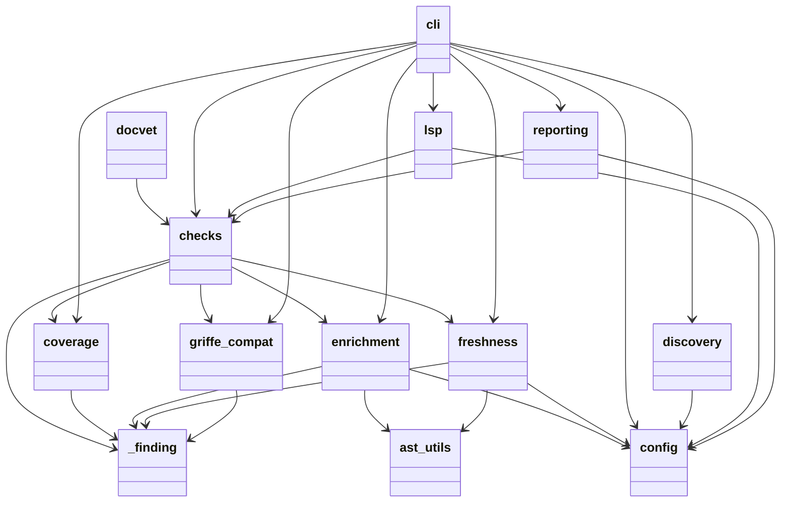
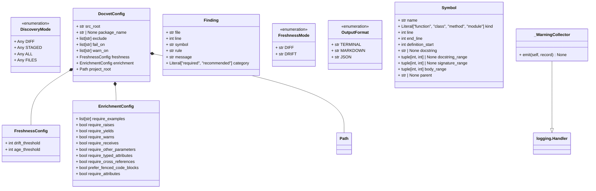
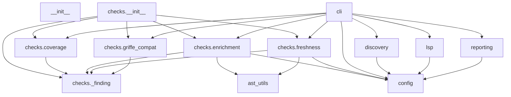

# Story 26.4: Research Auto-Generated Mermaid Diagrams

Status: done
Branch: N/A (spike — no production code changes)
GitHub Issue: https://github.com/Alberto-Codes/docvet/issues/216

<!-- Note: Validation is optional. Run validate-create-story for quality check before dev-story. -->

## Story

As a **docvet maintainer**,
I want to understand what tools or patterns exist for auto-generating Mermaid diagrams from Python codebases,
so that architecture diagrams can stay current with the code automatically rather than requiring manual updates.

## Acceptance Criteria

1. **Given** the Python ecosystem **When** researched **Then** a summary documents at least 3 approaches or tools for auto-generating Mermaid diagrams from Python code (e.g., AST-based module dependency graphs, import analysis, class hierarchy extraction)
2. **Given** the research results **When** evaluated against docvet's codebase **Then** each approach is assessed for: compatibility with Google-style docstrings, ability to leverage existing AST infrastructure (`ast_utils.py`), output quality, maintenance burden, and CI automation potential (can it run in a pipeline to detect diagram drift?)
3. **Given** docvet's own docstrings and module structure **When** a proof-of-concept is attempted with the most promising approach **Then** a sample auto-generated Mermaid diagram is produced and compared against the manual diagram from Story 26.3
4. **Given** the research is complete **When** summarized **Then** a recommendation is documented: adopt (with which tool/pattern), defer (promising but not worth it now), or skip (no viable approach)

## Tasks / Subtasks

- [x] Task 1: Research ecosystem tools and approaches (AC: 1)
  - [x] 1.1: Survey tools that produce graph output from Python code — group by output format (native Mermaid, DOT/Graphviz, PlantUML, custom). Candidates: `py2mermaid`, `pydeps`, `pyreverse` (pylint), `code2flow`, Graphviz-based converters
  - [x] 1.2: Assess Mermaid conversion paths for tools that don't output Mermaid natively (DOT → Mermaid, PlantUML → Mermaid)
  - [x] 1.3: Evaluate griffe's object model as a diagram source — already a project dependency, richer than raw AST (see "Griffe: Strongest Candidate" below)
  - [x] 1.4: Research custom AST walker approaches — stdlib `ast` for import graph extraction (note: `ast_utils.py` does NOT provide import analysis — see caveat below)
- [x] Task 2: Evaluate each approach against docvet (AC: 2)
  - [x] 2.1: Assess compatibility with Google-style docstrings (does the tool parse/use docstrings?)
  - [x] 2.2: Assess ability to leverage docvet's existing infrastructure (`ast_utils.py`, griffe)
  - [x] 2.3: Assess output quality — clean, readable Mermaid syntax compliant with `.claude/rules/mermaid.md`?
  - [x] 2.4: Assess maintenance burden — fully automatic, needs manual curation, or one-time generation?
  - [x] 2.5: Assess CI automation potential — can it run in a pipeline to detect diagram drift automatically?
  - [x] 2.6: Assess fit with mkdocs-material Mermaid rendering (superfences custom_fences)
- [x] Task 3: Proof-of-concept with most promising approach (AC: 3)
  - [x] 3.1: Run the most promising tool/approach against `src/docvet/`
  - [x] 3.2: Produce a sample Mermaid diagram from the auto-generated output
  - [x] 3.3: Compare against manual diagram in `docs/site/architecture.md` (Story 26.3) using explicit dimensions: node count, relationship accuracy, readability, information density, visual layout quality, compliance with `.claude/rules/mermaid.md`
  - [x] 3.4: Document comparison results with side-by-side assessment of each dimension
- [x] Task 4: Write recommendation (AC: 4)
  - [x] 4.1: Summarize findings in a comparison table (tool, output type, quality, maintenance burden)
  - [x] 4.2: Document recommendation: adopt / defer / skip — with evidence and rationale
  - [x] 4.3: If "adopt": specify tool, integration approach, and CI/update workflow — N/A (recommendation was "defer")
  - [x] 4.4: If "defer"/"skip": document what would change the decision

## AC-to-Test Mapping

<!-- Spike story — no code tests. Deliverables documented in Dev Notes sections below. -->

| AC | Test(s) | Status |
|----|---------|--------|
| 1 | Spike deliverable: 7 tools/approaches surveyed across 4 output format groups (native Mermaid, DOT/Graphviz, builder libraries, custom code). Exceeds "at least 3" requirement. See "Ecosystem Tool Survey" section. | PASS |
| 2 | Spike deliverable: All 7 approaches evaluated against 6 criteria (docstring compat, infrastructure leverage, output quality, maintenance burden, CI potential, mkdocs fit). See "Evaluation Against Docvet" section. | PASS |
| 3 | Spike deliverable: 4 tools run against `src/docvet/` — pyreverse (class + package), pymermaider (class), custom AST walker (module dependency), griffe (module dependency). Compared against manual diagram across 6 dimensions. See "PoC Results and Comparison" section. | PASS |
| 4 | Spike deliverable: Recommendation documented as "defer" with comparison table, evidence, rationale, and conditions that would change the decision. See "Recommendation" section. | PASS |

## Dev Notes

- **This is a SPIKE** — time-boxed investigation. Deliverable is a recommendation with evidence, not production code. Follow the same pattern as Story 25.5 (CI docs-freshness check spike).
- **No code changes expected** — the story file itself is the deliverable (consistent with 25.5 pattern). All research, evaluation, and recommendation are documented in this file. Quality gates run as baseline only.
- **Comparison target**: Story 26.3 created a manual Mermaid diagram at `docs/site/architecture.md` — 12 nodes, `flowchart TD`, dual-entry-point architecture (CLI + LSP converging on shared checks). This is the benchmark for AC 3.

### Existing Infrastructure to Evaluate Against

- **`ast_utils.py`**: Provides `get_documented_symbols()` returning flat `Symbol` list with `name`, `kind`, `line`, `parent`, `docstring`, `signature_range`, `body_range`. Useful for entity extraction but **does NOT capture import relationships** — `Symbol` has no import/dependency fields. A module dependency graph would need separate `ast.Import`/`ast.ImportFrom` analysis, not `get_documented_symbols()`.
- **`Symbol.kind`**: `Literal["function", "class", "method", "module"]` — covers entity types for class hierarchy diagrams.
- **`Symbol.parent`**: Enclosing class name — enables class-method relationship extraction (but not cross-module dependencies).
- **Griffe optional dep**: Griffe (`griffe >=1.0`) is already an optional dependency. Its object model (`griffe.dataclasses.Module`, `.Class`, `.Function`) is significantly richer than raw AST — includes resolved imports, inheritance, and member relationships. See "Griffe: Strongest Candidate" section below.
- **Module layout**: `src/docvet/` has 10 source modules (cli, config, discovery, ast_utils, reporting, lsp, checks/enrichment, checks/freshness, checks/coverage, checks/griffe_compat) + internal helpers (`_finding.py`).

### Research Angles (from epics file)

- `py2mermaid` — Python-to-Mermaid converter
- `pydeps` — module dependency graphs (may output DOT, need Mermaid conversion)
- `pyreverse` (from pylint) — class/package diagrams (outputs DOT/PlantUML, check for Mermaid)
- Custom AST walkers using docvet's own `ast_utils` — `get_documented_symbols()` → module dependency or call graph
- Griffe's object model as a diagram source — richer than raw AST, already a project dependency
- `code2flow` — control flow diagrams (may be too granular)

### Griffe: Strongest Candidate

Griffe deserves priority evaluation. It's already an optional docvet dependency, and its object model provides everything needed for diagram generation without raw AST walking:
- `griffe.load("docvet")` returns a full `Module` tree with resolved imports, classes, functions
- Members, inheritance, and cross-module references are already parsed
- A custom walker on the `Module` tree to emit Mermaid could be 50-100 lines
- The PoC should evaluate griffe first — if it works, external tools may be unnecessary

### Evaluation Criteria (from AC 2)

1. **Google-style docstring compatibility** — does the tool parse or leverage docstrings?
2. **AST infrastructure leverage** — can it use griffe or `ast_utils.py`, or does it need its own parser?
3. **Output quality** — clean Mermaid syntax that follows `.claude/rules/mermaid.md`?
4. **Maintenance burden** — fully automatic, needs manual curation, or one-time generation?
5. **CI automation potential** — can it run in a pipeline to detect diagram drift when code changes?

### Diagram Types to Consider

The manual diagram from 26.3 shows the **check pipeline** (data flow). Other useful diagram types:
- Module dependency graph (import relationships)
- Class hierarchy / composition
- Call graph (which functions call which)
- Check dispatch flow (how CLI → individual checks)

### Previous Story Intelligence (26.3)

- `docs/site/architecture.md` uses `flowchart TD` with 12 nodes, subgraph for 4 checks
- Mermaid rendering enabled via `pymdownx.superfences` with `custom_fences` in `mkdocs.yml`
- Material theme handles Mermaid natively — no external JS or plugins needed
- Diagram follows `.claude/rules/mermaid.md`: standard flowchart syntax, no C4, under 20 nodes
- Code review caught accuracy issue in LSP description — auto-generated diagrams should handle such nuances

### PoC Execution Guidance

- **External tools**: Use `uvx <tool-name> src/docvet/` or a temporary venv — do not add deps permanently
- **Griffe approach**: `python -c "from griffe import load; mod = load('docvet'); ..."` or a temp script in `/tmp`
- **Custom AST**: Write a temp script using `import ast` with `ast.Import`/`ast.ImportFrom` visitors — not `ast_utils.py`
- **Output**: Capture the raw Mermaid output, paste into the story file for comparison. Do NOT commit generated files.

### Comparison Dimensions for AC 3

When comparing auto-generated output against the manual diagram (`docs/site/architecture.md`):

| Dimension | What to assess |
|-----------|----------------|
| Node count | How many nodes? Under 20 per `.claude/rules/mermaid.md`? |
| Relationship accuracy | Do edges represent real code relationships? |
| Readability | Can a human quickly understand the diagram? |
| Information density | Right level of detail, or too noisy/sparse? |
| Visual layout quality | Clean flow direction? Meaningful node shapes? |
| Mermaid guideline compliance | Standard flowchart syntax, no C4, ` ` for line breaks? |

### Anti-Patterns (Do NOT)

- Do NOT install permanent dependencies for a spike — use temporary venvs or `uvx` for tool trials
- Do NOT modify `docs/site/architecture.md` — the manual diagram stays. PoC output is for comparison only.
- Do NOT add generated diagrams to the repo — this is evaluation, not integration
- Do NOT scope-creep into building a diagram generator — deliverable is a recommendation

### Project Structure Notes

- No product source files modified — spike produces this story document and analysis only
- If PoC code is written, it should be temporary (not committed) or in a scratch directory

### References

- [Source: _bmad-output/planning-artifacts/epics.md#Story 26.4]
- [Source: _bmad-output/implementation-artifacts/26-3-add-architecture-diagram-to-docs-site.md — Manual diagram reference]
- [Source: docs/site/architecture.md — The manual Mermaid diagram (comparison target)]
- [Source: src/docvet/ast_utils.py — Existing AST infrastructure]
- [Source: .claude/rules/mermaid.md — Diagram guidelines]
- [Source: _bmad-output/implementation-artifacts/25-5-investigate-ci-docs-freshness-check.md — Spike story pattern]

### Ecosystem Tool Survey (Task 1 Findings)

7 tools/approaches surveyed, grouped by output format:

**Native Mermaid Output:**

| Tool | Diagram Types | How It Works | Maintained? | Notes |
|------|--------------|-------------|-------------|-------|
| pyreverse (pylint) | Class + Package | AST analysis via pylint; `-o mmd` flag | Active (via pylint 3.3.x) | Known bugs in Mermaid output (return types, module names) |
| pymermaider | Class only | Rust-based Python parser; outputs `.mmd`/`.md` | Active (40 stars, v0.1.5+) | Clean output; handles attributes, inheritance, composition |

**DOT/Graphviz Output (requires conversion):**

| Tool | Diagram Types | How It Works | Maintained? | Notes |
|------|--------------|-------------|-------------|-------|
| pydeps | Module dependency | Bytecode import analysis; outputs SVG/PNG via DOT | Active (2.1k stars, v3.0.2) | Requires Graphviz; no Mermaid support |
| code2flow | Call graphs | AST-based caller/callee mapping; outputs DOT | Stale (last release Jan 2023) | 4.5k stars but unmaintained |

**Builder Libraries (not code analyzers):**

| Tool | What It Does | Notes |
|------|-------------|-------|
| py2mermaid | Programmatic Mermaid syntax builder | NOT a code analyzer — requires manual node/edge definition. 2 GitHub stars. Not useful for auto-generation. |

**Custom Code Approaches:**

| Approach | Diagram Types | Infrastructure | Notes |
|----------|--------------|---------------|-------|
| Custom AST walker (`ast.Import`/`ast.ImportFrom`) | Module dependency | stdlib `ast` only | ~50 lines; reliable import extraction; direct Mermaid output |
| Griffe object model walker | Module dep, class hierarchy | griffe (existing optional dep) | Rich object model but alias resolution fails for import graph extraction |

**Mermaid Conversion Paths (Task 1.2):**

- **DOT → Mermaid**: `dot2mermaid` (Python package), or `pydot` + custom emitter. ~80-90% topology fidelity; styling lost.
- **PlantUML → Mermaid**: `pu2mm`, `convert2mermaid` CLI, web converters. Sequence diagrams convert best; class diagrams lose some UML specifics.
- **Reliability**: Conversion adds a fragile step. Native Mermaid output is strongly preferred over conversion pipelines.

**Griffe Evaluation (Task 1.3):**

Griffe's object model (`griffe.load("docvet")`) provides a walkable tree of Module/Class/Function objects with members, docstrings, and aliases. However, the PoC revealed that **alias resolution for import extraction is unreliable** — `AliasResolutionError` on `__future__` imports, and resolved aliases don't cleanly map to "module X imports from module Y." Griffe is designed for documentation generation, not dependency graph analysis. A custom walker on griffe produced 12 nodes but 0 edges.

**Custom AST Walker (Task 1.4):**

A ~50-line stdlib `ast` script visiting `ast.ImportFrom` nodes produced the most accurate module dependency graph (13 nodes, 23 edges). This approach is zero-dependency, deterministic, and produces direct Mermaid `flowchart TD` output. docvet's `ast_utils.py` is NOT useful here — it extracts documented symbols (function/class/method metadata), not import relationships.

### Evaluation Against Docvet (Task 2 Findings)

| Criterion | pyreverse | pymermaider | pydeps + convert | Custom AST | Griffe custom |
|-----------|-----------|-------------|------------------|------------|---------------|
| **Docstring compat** | Ignores docstrings | Ignores docstrings | Ignores docstrings | Ignores docstrings | Parses docstrings (unused for diagrams) |
| **Infrastructure leverage** | None (own parser) | None (Rust parser) | None (bytecode) | stdlib `ast` only | Uses existing griffe dep |
| **Output quality** | Class: good; Package: uses `classDiagram` for deps (wrong type). Known Mermaid bugs. | Class: clean, correct. Class-only limitation. | DOT quality good; conversion loses fidelity | Excellent — clean `flowchart TD`, correct edges, readable | Failed — 0 edges extracted |
| **Maintenance burden** | Zero (external tool, run on demand) | Zero (external tool) | Medium (conversion pipeline) | Low (custom script to maintain) | High (custom code + fragile alias resolution) |
| **CI automation** | Yes (`uvx --from pylint pyreverse -o mmd`) | Yes (`uvx pymermaider`) | Complex (multi-tool pipeline) | Yes (run Python script, diff output) | Unreliable (alias resolution errors) |
| **mkdocs-material fit** | `classDiagram` renders fine; `flowchart` would be better for deps | `classDiagram` renders fine | After conversion, yes | `flowchart TD` renders perfectly | N/A (failed) |

**Key findings:**
- No tool produces the same *type* of diagram as the manual one. The manual diagram is a data-flow/architecture diagram (CLI/LSP → Config → Discovery → Checks → Reporting). Tools produce either class diagrams or module dependency graphs — different purposes.
- **Custom AST walker** produced the closest match to the pyreverse package diagram and is the most reliable for module dependency visualization.
- **pymermaider** produced the best class diagram — clean Mermaid with attributes, types, and composition relationships.
- **pyreverse** produced both diagram types but its Mermaid package diagram uses `classDiagram` syntax instead of `flowchart` (less ideal for dependency visualization).
- **Griffe** failed as a diagram source — alias resolution is not designed for import graph extraction.

### PoC Results and Comparison (Task 3 Findings)

Four approaches were run against `src/docvet/`:

**1. pyreverse package diagram** (module dependencies as `classDiagram`):
- 12 module nodes, correct import edges
- Uses `classDiagram` syntax (empty class bodies with `-->` edges)
- Accurate but visually suboptimal — class diagram syntax for a dependency graph

**2. pymermaider class diagram** (data classes and enums):
- 9 classes: `DiscoveryMode`, `EnrichmentConfig`, `FreshnessConfig`, `DocvetConfig`, `Finding`, `FreshnessMode`, `OutputFormat`, `Symbol`, `_WarningCollector`
- Includes attributes with types, inheritance (`_WarningCollector --|> logging.Handler`), composition (`DocvetConfig *-- FreshnessConfig`)
- Clean Mermaid output, renders correctly

**3. Custom AST walker** (module dependency `flowchart TD`):
- 13 nodes, 23 edges
- Accurate import relationships extracted from `ast.ImportFrom` analysis
- Direct `flowchart TD` output with descriptive node labels

**4. Griffe custom walker** (attempted module dependency):
- 12 nodes, **0 edges** — alias resolution failed to extract import relationships
- `AliasResolutionError` on `__future__` imports interrupted traversal

**Comparison against manual diagram (`docs/site/architecture.md`):**

| Dimension | Manual (26.3) | Custom AST Walker | pyreverse (package) | pymermaider (class) |
|-----------|---------------|-------------------|--------------------|--------------------|
| **Node count** | 12 | 13 (under 20 limit) | 12 (under 20 limit) | 9 (under 20 limit) |
| **Relationship accuracy** | Curated data flow (conceptual) | Import edges (structural, complete) | Import edges (structural, correct) | Class composition/inheritance (structural) |
| **Readability** | High — entry points, subgraph, output stages | Medium — many crossing edges, flat layout | Low — empty class bodies look odd for deps | High — familiar UML-style class diagram |
| **Information density** | Right level — shows architecture, not implementation | Noisy — every internal import shown (23 edges for 13 modules) | Moderate — same edges as AST but in class syntax | Right level for class structure |
| **Visual layout quality** | High — meaningful shapes (stadiums for I/O), subgraph grouping | Medium — no grouping, no shape variation | Low — all rectangles, no visual hierarchy | High — standard UML conventions |
| **Mermaid compliance** | Full (`flowchart TD`, standard shapes, under 20 nodes) | Full (`flowchart TD`, under 20 nodes) | Partial (`classDiagram` for deps = wrong type) | Full (`classDiagram`, standard syntax) |

**Key insight:** The manual diagram and the auto-generated diagrams serve *different purposes*. The manual diagram is an **architecture overview** (data flow, entry points, output stages). Auto-generated diagrams produce **structural snapshots** (import graphs, class hierarchies). These are complementary, not substitutes.

### Raw PoC Output (Added During Code Review)

The following are the actual Mermaid outputs from the 3 working PoC tools, preserved for independent verification of the comparison table above. Griffe produced 0 edges and is omitted (see text above).

**1. pyreverse — package diagram (`packages_docvet.mmd`):**

**2. pymermaider — class diagram (`output/docvet.md`):**

**3. Custom AST walker — module dependency (`flowchart TD`):**

### Recommendation (Task 4)

**Comparison Table:**

| Tool | Output Type | Mermaid? | Quality | Maintenance | CI Ready? | Verdict |
|------|-----------|----------|---------|-------------|-----------|---------|
| pyreverse | Class + Package | Native `.mmd` | Class: good; Package: wrong diagram type | Zero | Yes | Best for class diagrams |
| pymermaider | Class only | Native `.mmd` | Excellent | Zero | Yes | Best class diagram quality |
| pydeps | Module deps | No (DOT only) | Good (as SVG) | Conversion pipeline needed | Complex | Skip — conversion fragile |
| code2flow | Call graphs | No (DOT only) | Unknown | Unmaintained | No | Skip — stale project |
| Custom AST | Module deps | Custom code | Excellent | ~50-line script | Yes | Best for module dependency |
| Griffe custom | Any | Custom code | Failed (0 edges) | High | No | Skip — alias resolution broken |
| py2mermaid | N/A (builder) | Yes (manual) | N/A | N/A | No | Skip — not a code analyzer |

**Recommendation: DEFER**

Auto-generated Mermaid diagrams are technically feasible but not worth adopting now. Evidence:

1. **No tool replaces the manual architecture diagram.** The manual diagram (26.3) is a curated data-flow overview showing entry points, check pipeline, and output stages. Auto-generated tools produce structural snapshots (import graphs, class hierarchies) — useful but different. The manual diagram would still need manual maintenance.

2. **Two useful auto-generated diagram types exist** but don't justify the investment now:
   - **Module dependency graph** (custom AST walker, ~50 lines) — useful for onboarding, but docvet has only 12 modules. The architecture page + module table already communicates this clearly.
   - **Class diagram** (pymermaider) — useful for understanding data model relationships, but docvet has only 9 classes. The current docs site doesn't need this level of detail.

3. **CI diagram drift detection is solvable** (generate diagram, diff against committed version, warn on divergence), but the overhead of maintaining the generation script + CI job exceeds the value for a stable, small codebase.

4. **The manual diagram is the right level of abstraction.** It shows *why* the architecture works (dual entry points, shared checks, separate output paths), not just *what imports what*. No auto-generation tool captures this.

**What would change the decision:**

- **Codebase grows significantly** (20+ modules, complex class hierarchies) — auto-generated module dependency and class diagrams would add value
- **Multiple contributors** who need structural orientation — auto-generated diagrams serve as always-current onboarding aids
- **Griffe alias resolution improves** — if griffe gains reliable import graph extraction, a custom walker on its object model could serve both documentation and diagram purposes with one dependency
- **A tool emerges that generates data-flow diagrams** (not just import graphs) — this would directly compete with the manual diagram and make auto-generation worth adopting

### Documentation Impact

- Pages: None — no user-facing changes
- Nature of update: N/A — spike produces no code or docs changes; recommendation documented in story file only

## Quality Gates

<!-- No code changes — quality gates verified as baseline only. -->

- [x] `uv run ruff check .` — zero lint violations (baseline, no changes)
- [x] `uv run ruff format --check .` — zero format issues (baseline, no changes)
- [x] `uv run ty check` — zero type errors (baseline, no changes)
- [x] `uv run pytest` — 971 tests pass (baseline, no changes)
- [x] `uv run docvet check --all` — zero docvet findings (baseline, no changes)
- [x] `uv run interrogate -v` — docstring coverage 100% (baseline, no changes)

## Dev Agent Record

### Agent Model Used

Claude Opus 4.6

### Debug Log References

No debug sessions required. Spike — research and analysis only.

### Completion Notes List

- Surveyed 7 tools/approaches across 4 output format categories (native Mermaid, DOT/Graphviz, builder libraries, custom code)
- Ran 4 PoC tools against `src/docvet/`: pyreverse (class + package), pymermaider (class), custom AST walker (module dependency), griffe (module dependency — failed)
- Key finding: auto-generated diagrams produce structural snapshots (import graphs, class hierarchies), not architecture overviews — complementary to but not a substitute for the manual diagram
- Griffe hypothesis disproven: alias resolution is unreliable for import graph extraction despite rich object model
- Custom AST walker (~50 lines) produced the most accurate module dependency graph; pymermaider produced the best class diagram
- Recommendation: defer — manual diagram is the right abstraction level for docvet's current scale

### Change Log

- 2026-02-28: Spike completed — ecosystem research (7 tools), 4 PoC runs, 6-dimension comparison, and recommendation documented
- 2026-02-28: Code review fixes — added raw PoC Mermaid output for independent verification, fixed module count (9 → 10), annotated Task 4.3 as N/A

### File List

- `_bmad-output/implementation-artifacts/26-4-research-auto-generated-mermaid-diagrams.md` — this story file (spike findings and recommendation)

## Code Review

<!-- Spike story — findings documented in story file serve as the deliverable. -->

### Reviewer

Adversarial code review (BMAD workflow) on 2026-02-28. Party mode consensus with Dev, SM, and Tech Writer agents.

### Outcome

3 findings (1 MEDIUM, 2 LOW) identified and fixed. 2 additional findings (L2 node count, L3 Mermaid compliance depth) dropped by party mode consensus as non-findings.

### Findings Summary

| ID | Severity | Description | Resolution |
|----|----------|-------------|------------|
| M1 | MEDIUM | Raw PoC Mermaid output not preserved — AC 3 unverifiable from story alone | Fixed: added "Raw PoC Output" section with 3 diagram code blocks |
| M2 | LOW | Module count "9 source modules" — actual count is 10 | Fixed: corrected to "10 source modules" |
| L1 | LOW | Task 4.3 marked [x] when condition was N/A (recommendation was "defer" not "adopt") | Fixed: added N/A annotation |

### Verification

- [x] All acceptance criteria verified (spike deliverables: tool survey, evaluation, PoC comparison, recommendation)
- [x] All quality gates pass (baseline — no code changes)
- [x] Story file complete (AC-to-Test Mapping, Dev Notes, Change Log, File List all filled)
