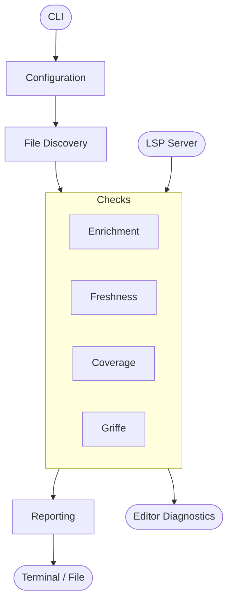

# Architecture

Whether you run docvet from the command line or your editor, the same checks analyze your code. The diagram below shows how the two entry points — the CLI and the LSP server — converge on a shared checks layer that powers all docstring analysis.

## Check Pipeline

The **CLI path** loads configuration from `[tool.docvet]` in `pyproject.toml`, discovers target files (via git diff, staged changes, `--all`, or positional arguments), runs the enabled checks, and formats the results through the reporting module.

The **LSP path** receives files directly from the editor via `textDocument/didOpen` and `textDocument/didSave`, runs enrichment, coverage, and griffe checks on each file, and returns diagnostics to the editor. Freshness is excluded — it requires git context that single-file LSP mode doesn't have. The LSP also skips file discovery and reporting, which are CLI concerns.

!!! note "Coverage is directory-level"
    The enrichment, freshness, and griffe checks operate per-file. Coverage scans directories for missing `__init__.py` files instead.

## Modules

| Module | Purpose |
|--------|---------|
| `cli.py` | Typer CLI — config loading, file discovery, check dispatch, output |
| `config.py` | Reads `[tool.docvet]` from `pyproject.toml` |
| `discovery.py` | Finds target files via git diff, staged, `--all`, or positional args |
| `checks/enrichment.py` | Missing sections detection — 10 rules (AST analysis) |
| `checks/freshness.py` | Stale docstring detection — 5 rules (git diff + git blame) |
| `checks/coverage.py` | Missing `__init__.py` detection — 1 rule (directory scan) |
| `checks/griffe_compat.py` | Griffe parser warning capture — 3 rules |
| `reporting.py` | Formats findings as terminal, markdown, or JSON output |
| `lsp.py` | LSP server — reuses checks for real-time editor diagnostics |

## Contributing a New Check

To add a new check, create a module in `src/docvet/checks/` and register it in `cli.py`. For LSP support, also add it to the `_check_file` function in `lsp.py`. Each check module exposes a public function that returns a `list[Finding]` — see existing checks for the expected signature patterns. Checks are isolated — they share no state and must not import from each other.
